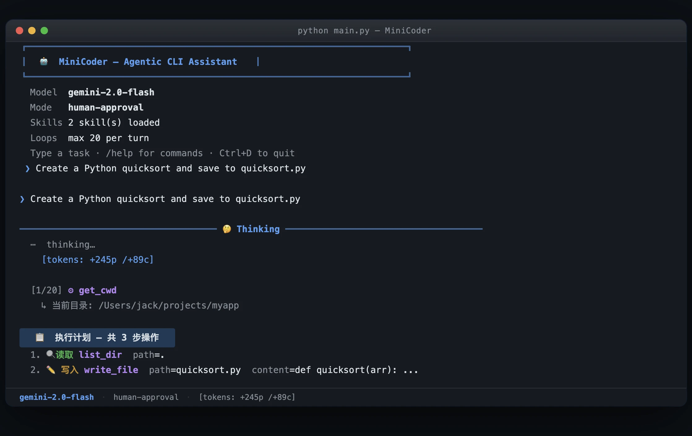

**English** | [中文](README_zh.md)

# MiniCoder

> 🔬 Curious how agentic coding assistants like Claude Code / Cursor work? MiniCoder implements the same core ideas in pure Python — read the code, learn the patterns.

MiniCoder is a lightweight, local-first agentic CLI coding assistant. It implements the core building blocks shared by tools like Claude Code — agent loop, tool calling, multi-step reasoning, human-in-the-loop approval, context management, and persistent memory — in a small, readable Python codebase that's easy to follow and modify.

I built it because I wanted a coding agent that stays out of my way until I tell it to act. It runs in your terminal, can read/write files, search codebases, and execute shell commands — but it always shows you the plan first and waits for your approval before doing anything destructive. No surprises.

No Electron. No cloud sync. No subscription. Just Python, your API key, and a REPL.

[](https://www.python.org/)
[](LICENSE)

<p align="center">
  
</p>


### 🎯 Why MiniCoder?

If you want to understand how agentic coding assistants work, reading a compact implementation is the fastest way:

- **Learn by reading** — Clean, well-structured Python. Each component (agent loop, tool dispatch, context compression, memory) corresponds to a real pattern used in Claude Code / Cursor / Windsurf.
- **Learn by doing** — Swap models, add new tools, change approval logic, tweak the prompt — then see how behavior changes.
- **Actually usable** — Handles real-world coding tasks with multi-step reasoning, background execution, and session persistence.

---

## ✨ Features

### Core Agent Loop
- **Multi-step reasoning** — plans, calls tools, inspects results, and iterates until the task is done (up to `max_loops` per turn).
- **Human-in-the-loop approval** — every non-read-only batch of tool calls is presented as a numbered plan. Approve all, deny all, pick specific steps, or send feedback to redirect.
- **Sub-agent dispatch** — for heavy research tasks (e.g. "analyse the entire codebase"), a fresh sub-agent runs with its own clean context and returns only a text summary, keeping the main session uncluttered.

### File & Code Operations
- **Surgical edits** — `replace_in_file` makes targeted, minimal diffs with fuzzy-match hints when exact text isn't found; full rewrites only when necessary.
- **Large-file awareness** — checks line count before reading; supports `start_line`/`end_line` to avoid loading a 5 000-line file when you only need 20 lines of it.
- **Codebase search** — grep across all common text file types; find files by glob pattern.

### Shell & Background Tasks
- **Foreground commands** — runs shell commands with a safety blocklist (`rm -rf`, `format`, `del /f /s`, …) and a configurable timeout.
- **Background task execution** — long-running commands (`npm install`, `pytest`, `docker build`) run in a background thread; the agent is automatically notified when they finish so the conversation keeps moving.

### Memory & Persistence
- **Skills** — tell the agent *"remember how to deploy this project"* and it saves a Markdown workflow to `skills/`. Skills are auto-injected into the system prompt at every session start.
- **Session persistence** — save and restore full conversation history with `/save` and `/load`.
- **Task tracking (TodoWrite)** — for multi-step work, the agent maintains a live checklist, ticking items from `pending` → `in_progress` → `done` in real time so you always know where things stand.
- **Three-layer context compression** — old tool results are silently condensed each turn; when the context limit approaches, the whole conversation is summarised by the LLM and saved as a JSONL transcript before being replaced with the summary.

### Compatibility
- **Any OpenAI-compatible API** — OpenAI, Azure OpenAI, Google Gemini (via compatibility layer), local Ollama, DeepSeek, and others.
- **prompt_toolkit TUI** — clean, keyboard-navigable terminal interface with syntax highlighting; no Textual or curses dependencies.

---

## 📦 Installation

```bash
git clone https://github.com/jackrx259/MiniCoder.git
cd MiniCoder

# uv creates the virtual environment and installs deps in one step
uv sync
```

> Don't have `uv`? `pip install uv` or see [uv's docs](https://docs.astral.sh/uv/).

---

## ⚙️ Configuration

**1.** Copy the example config:

```bash
cp config.example.json config.json
```

**2.** Edit `config.json`:

```json
{
    "api_key": "sk-...",
    "api_base": "https://api.openai.com/v1",
    "model": "gpt-4o",
    "max_loops": 20,
    "timeout": 60,
    "max_retries": 3
}
```

| Field | Description |
|-------|-------------|
| `api_key` | Your API key — **never commit this file** (it's in `.gitignore`) |
| `api_base` | Endpoint; change for Azure, Gemini, Ollama, etc. |
| `model` | e.g. `gpt-4o`, `gemini-1.5-pro`, `llama3` |
| `max_loops` | Max tool-call iterations per turn (default: `20`) |
| `timeout` | Request timeout in seconds (default: `60`) |
| `max_retries` | Retries on 429 / 5xx (default: `3`) |
| `max_context_tokens` | Token threshold for auto-compact (default: `50000`) |
| `system_prompt` | *(Optional)* Override the system prompt |

**3.** Run:

```bash
python main.py
```

---

## 🚀 CLI Flags

| Flag | Description |
|------|-------------|
| `--auto` / `--yolo` | Auto-approve all tool calls (no prompting) |
| `--model MODEL` | Override the model from `config.json` |
| `--max-loops N` | Override max tool-call loops per turn |
| `--no-skills` | Disable skills injection |
| `--config PATH` | Use a custom config file path |

---

## 💬 REPL Commands

| Command | Description |
|---------|-------------|
| `/help` | Show help |
| `/clear` | Clear conversation history (keeps system prompt) |
| `/history` | Show message count and role breakdown |
| `/save [file]` | Save session to JSON (default: `session.json`) |
| `/load [file]` | Load session from JSON |
| `/usage` | Show cumulative token usage |
| `exit` / `quit` | End the session (offers to save) |
| `Ctrl+C` | Interrupt current agent action |
| `Ctrl+D` | Quit immediately |

---

## 🔍 Plan Approval

Before any write/execute action, you see a numbered plan and a one-key prompt:

| Input | Action |
|-------|--------|
| `y` / Enter | Approve and run all steps |
| `n` | Reject the entire plan |
| `a` | Switch to full-auto for the rest of the session |
| `1`, `1,3`, … | Run only the specified step numbers |
| Any other text | Sent as feedback; agent revises the plan |

Pure read-only tool batches are approved silently and never shown as a plan.

---

## 🛠 Available Tools

| Tool | Description |
|------|-------------|
| `read_file` | Read file (supports `start_line`/`end_line`) |
| `write_file` | Full file overwrite |
| `append_to_file` | Append without reading first |
| `replace_in_file` | Surgical replacement with fuzzy-match hints |
| `get_file_info` | Line count + size before reading a large file |
| `list_dir` | Directory listing with sizes |
| `find_files` | Find files by glob (e.g. `src/**/*.ts`) |
| `search_files` | Grep across all common text types |
| `get_cwd` | Current working directory |
| `change_dir` | Change working directory |
| `run_command` | Foreground shell command (blocklist + timeout) |
| `run_background` | Background command; auto-notifies on finish |
| `check_background` | Poll a running background task |
| `todo_write` | Create / update a live task checklist |
| `create_skill` | Save a reusable workflow for future sessions |
| `list_skills` | List all saved skills |
| `delete_skill` | Remove an outdated skill |
| `dispatch_task` | Spawn a sub-agent for large research tasks |

---

## 🧠 Skills (Persistent Memory)

Tell the agent to remember something once — it writes a Markdown workflow to `skills/` and loads it automatically next time. You can manage skills with `list_skills` and `delete_skill`, or just ask the agent to do it. The `skills/` directory is gitignored so your personal workflows stay local.

---

## 💾 Session Persistence

- On startup, if `session.json` exists, you're offered to restore it.
- `/save` to checkpoint; `/load` to restore later.
- On exit, you're offered to save before closing.

> `session.json` may contain sensitive conversation content — it's gitignored by default.

---

## 🗜 Context Management

Long sessions are handled with three layers:

1. **Micro-compact (every turn)** — old tool results beyond the last 6 are replaced with short placeholders (`[used read_file]`). Invisible to the user; tokens freed.
2. **Auto-compact (threshold-triggered)** — when estimated tokens exceed `max_context_tokens`, the full conversation is saved as a JSONL transcript in `.transcripts/` and replaced with an LLM-generated summary.
3. **Manual** — `/clear` resets the conversation while keeping the system prompt and skills.

---

## License

[MIT](LICENSE)
